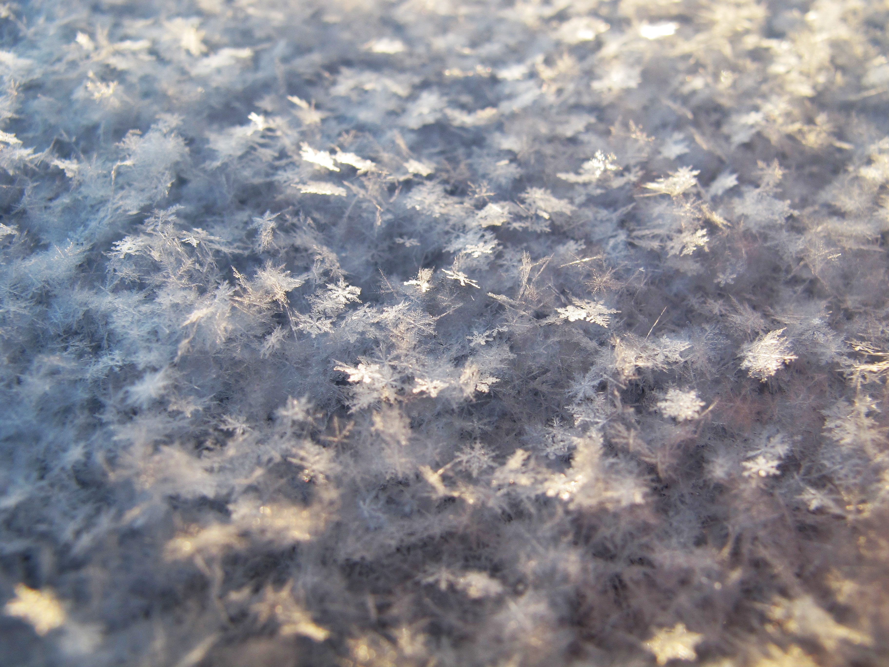

# Singh Catering Services

  <a id="snowflake" href="https://unsplash.com/@kalleandco?utm_medium=referral&amp;utm_campaign=photographer-credit&amp;utm_content=creditBadge" target="_blank" rel="noopener noreferrer" title="Download free do whatever you want high-resolution photos from Kalle Kortelainen">
        
            <svg xmlns = "http://www.w3.org/2000/svg" viewBox="0 0 32 32">
                <title>unsplash-logo</title>
                <path d = "M10 9V0h12v9H10zm12 5h10v18H0V14h10v9h12v-9z"></path>
            </svg>
          
        

          
          

          Winter Season 20% Discount
          

        

        Kalle Kortelainen
    </a>

## About ##

Order.js is the first ES6 program (through the console) I have made that is hosted on GitHub through Git workflow. The person takes an order through a function call and the price is calculated based on what they ordered and how many items. 

<object width = "900" height = "270" data = "README.html" type = "text/html"></object>

    <form>
        

            <label for = "orderType">Enter the type of food order: </label>
            <select onchange = "enableFields(this); removeUnnecessary(this.parentNode);" name = "orderType" id = "orderType" required>
                <option value = "">--Select a type--</option>
                <option value = "pizza"> Pizza </option>
                <option value = "hotDog"> Hot Dog </option>
                <option value = "fries"> Fries </option>
                <option value = "drink"> Drink </option>
                <option value = "burger"> Burger </option>
            </select>
        

        

            <label for = "orderTopping">Enter your topping: </label>
            <select class = "pizza" disabled id = "orderTopping" name = "orderTopping">
                <option value = "">--Select a Topping--</option>
                <option value = "pepperoni"> Pepperoni </option>
                <option value = "mushroom"> Mushroom </option>
                <option value = "veggie"> Vegetable </option>
                <option value = "sausage"> Sausage </option>
                <option value = "anchovy"> Anchovy </option>
                <option value = "sun-dried"> Sun Dried Tomatoes </option>
                <option value = "fresh-basil"> Fresh Basil </option>
                <option value = ""> None </option>
            </select>
        

        

            <label for = "crustType">Enter your crust: </label>
            <input class = "pizza" disabled type = "text" name = "crustType" id = "crustType">  
        

        

            Enter the size: 
            <input type = "radio" name = "size" id = "small" value = "small">
            <label for = "small">Small</label>
            <input type = "radio" name = "size" id = "medium" value = "medium">
            <label for = "medium">Medium</label>
            <input type = "radio" name = "size" id = "large" value = "large">
            <label for = "large">Large</label>
        

        

            <label for = "quantity">Enter your quantity: </label>
            <input class = "pizza hotDog fries drink burger" disabled type = "number" id = "quantity" name = "quantity" min = "1" max = "30" value = "1">
        

        

            <label for = "drink">Enter your drink: </label>
            <input class = "drink" disabled type = "text" name = "drink" id = "drink">
        

        

            <label for = "condiments">Enter your condiments: </label>
            <select class = "hotDog burger fries" disabled name = "condiments" id = "condiments">
                <option value = "">--Select a condiment--</option>
                <option value = "Ketchup"> Ketchup </option>
                <option value = "Mustard"> Mustard </option>
                <option value = "Relish"> Relish </option>
                <option value = "Chili"> Chili </option>
            </select>
        

        

            <label for = "doneness">How do you want your patty cooked? </label>
            Rare
            <input disabled type="range" class = "burger" name = "doneness" id = "doneness" value="3" min="1" max="5">
            Well-Done
        

        <input type = "button" value = "Remove Order" onclick = "removeOrder(this)">
    </form>
    <input id = "writeroot" type = "button" value = "+ Add Order" onclick = "duplicateForm()" />
    <input id = "finish-order" disabled type = "button" value = "Finish Order" onclick = "orderAll()">

 
    
 

[Home](https://knowledgeablekangaroo.github.io)

## Attributions ##

### Favicon ###

### On-Page ###

<a href = "#snowflake">Snowflake Photo</a>
Photo by Kalle Kortelainen on Unsplash

